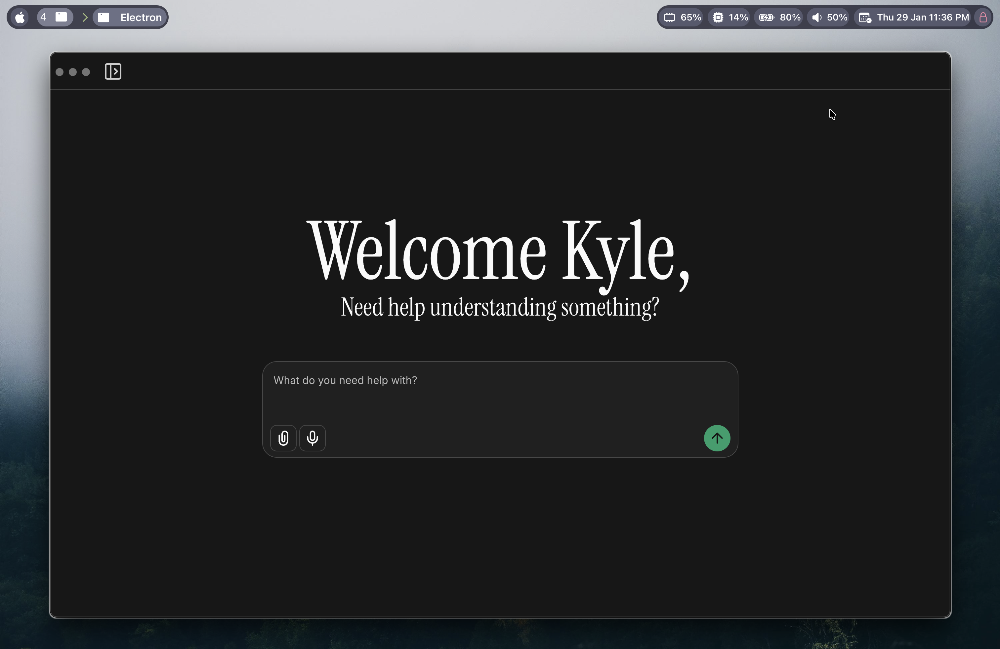

# Doc AI




> Doc AI is a local desktop document intelligence application that I wanted to make that pairs an Electron + React renderer with a FastAPI + LangChain/Ollama backend.

## Table of Contents

- [Summary](#summary)
- [Technical Choices](#technical-choices)
- [Architecture Overview](#architecture-overview)
- [Development Setup](#development-setup)
- [Milestones & Progress](#milestones--progress)
- [Roadmap](#roadmap)
- [Validation Workflow](#validation-workflow)
- [Notes](#notes)

## Summary

Doc AI is a hybrid desktop/web assistant that will let users upload documents, ask questions, and manage chats using a vector retrieval pipeline. While this project is still under construction, every commit showcases the decisions I've made around tooling, modular architecture, and how the stack that I chose will perform after packaging everything.

## Technical Choices

- **Frontend stack:** Electron + Vite + React with TanStack Router and TanStack Query helps me to keeps the navigation and data fetching type-safe making it easier when developing, plus the type suggestions for the routing is helpful, it helps for anyone that I decide to colab with to avoid using routes incorrectly, while Tailwind helps easy to easily set up for responsive styling for my UI, and making css development quicker.

- **Backend stack:** FastAPI with a lifespan managed SQLite schema since I wanted to keep the data source only on harware for security. SQLite was more than enough, modular routers (documents, chats, retrieve, health) to help keep routes organized to avoid sifting through a file, and CORS locked to the renderer host lays a clean foundation for API so that I can ensure that my backend stays structured I may plan to access outside services later but maintain data locally.

- **RAG + AI:** LangChain with Ollama Chat to build my front facing agent and handle embeddings plus a Chromadb backed vector store preps Doc for secure and fast retrieval, streaming context. I do plan on adding future agents given some local of the model improvements lately. 

- **Tooling:** ESLint/TypeScript strict mode enforce high quality, Electron Builder supports packaging, and Tailwind utilities keep the UI consistent.

## Architecture Overview

- **Electron + Renderer:** `frontend/src/main.tsx` configures React Query + TanStack Router, while `PromptInput` handles prompt submission, attachments, and a microphone action inside a reusable component.
- **FastAPI Lifecycle:** `backend/main.py` primes SQLite on startup via `database_setup`, wires routers, and keeps hot reload active for rapid iteration.
- **Data Layer:** `backend/db/db.py` defines chat/document/chunk tables and `DocumentProcessor` + vector store files scaffold embedding + persistence work for future retrieval.
- **Agent Layer:** `backend/models/doc.py` bundles a LangChain Ollama system/human message flow that will ultimately respond with document-aware answers.

## Development Setup (If you want to make your own version or collaborate)

#### (I'm adding Dockerfile soon to help make running things easier for others)

1. Clone the repo and install frontend dependencies:

   ```bash
   cd frontend
   npm install
   ```

2. Activate the `backend/firstvenv` virtualenv and install backend packages:

   ```bash
   source backend/firstvenv/bin/activate
   python -m pip install -r backend/requirements.txt
   ```

3. Copy `.env.example` to `.env` and configure `FRONTEND_URL`, `DB_PATH`, `APP_NAME`, and `APP_AUTHOR` so FastAPI CORS and Chromadb paths use the correct targets.

### Running

- **Frontend:**

  ```bash
  cd frontend
  npm run dev
  ```

- **Backend:**

  ```bash
  python backend/main.py
  ```

  FastAPI starts with hot reload, initializes the SQLite tables (`chat_sessions`, `chat_messages`, `documents`, `chunks`), and exposes placeholder routers for documents, chats, retrieve, and health.

## Milestones & Progress

### Completed

- Structured SQLite schema + FastAPI lifespan (`backend/main.py`, `backend/db/db.py`).
- Implemented placeholder routers for documents/chats/retrieve/health with consistent payload helpers (`backend/routes`).
- Added LangChain Ollama doc agent plus OllamaEmbeddings and Chromadb vector store scaffolding for retrieval (`backend/models/doc.py`, `backend/rag/embedding_model.py`, `backend/rag/vector_store.py`).
- Built Electron renderer with TanStack Router/React Query, plus the `PromptInput` component supporting auto-resize, attachment, and mic affordances (`frontend/src/*`).

### In Progress

- Filling out document parsing/processing and vector-store search/update flows (`backend/rag/documentparser.py`, `backend/rag/documentprocessor.py`, `backend/rag/vector_store.py`).
- Connecting placeholder endpoints to help the data percist and binding the UI to live API responses.

## Roadmap

- Persist documents/chats inside SQLite + Chromadb so LangChain can use real context.
- Finish `DocumentProcessor` + vector store CRUD to support search-based assistants.
- Polish the renderer experience (tooltips, navigation, real chat screens on the frontend's side) and tie `PromptInput` into the backend flows.
- Package with Electron Builder once core experiences are validated.

## Validation Workflow

- `npm run lint` ensures ESLint + TypeScript checks stay green.
- `npm run build` (or `npx tsc --noEmit`) verifies the frontend alongside Electron Builder packaging steps.

## Notes

- The API currently returns placeholders while persistence + retrieval logic is completed.
- Contributions welcome: open issues for missing functionality or create PRs aligned with the roadmap above.
